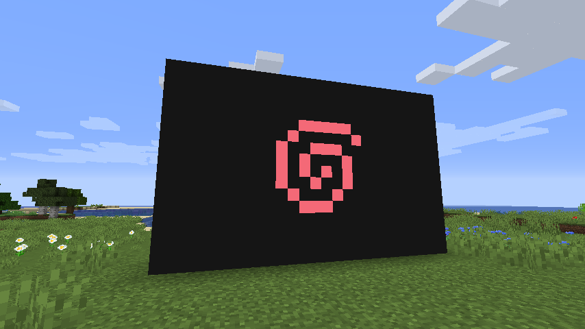

# Project Inception

_What if you could play Minecraft inside of Minecraft?_

This is the source code for Project Inception, a 1.16 Fabric
mod that allows you to play Minecraft - inside of Minecraft.

Note that as of right now 
**EVERYTHING IS EXTREMELY WORK-IN-PROGRESS**.
Arc'blroth does not make any guarantees that this mod will
work on your computer, and guarantees that the mod will probably
softlock your computer if you have too many Chrome tabs open.
You are solely responsible for any crashes/damages to your 
computer or sanity that this mod may cause.

All issues should be reported here using Github Issues.
Please check the [below FAQ](#Known-Issues--FAQ) before 
opening an issue - it'll save both you and me lots of time.
When opening an issue, please follow the template and include
relevant logs *in the form of an external pastebin link*.

If you're a fellow modder and wish to join me in losing your
sanity, feel free to submit pull requests :).

## Known Issues & FAQ

* As of now, Project Inception is a **client-side only** mod.
  This means that you won't be able to run it on a server
  (and you shouldn't either because that would allow players
  to overload your server very quickly ;)).

* Project Inception uses memory-mapped files for
  interprocess communication. This means that this mod
  WILL NOT work if you happen to run MC from a network drive.
  
* Q: Why is multiplayer disabled in the inception'ed game?

  A: Minecraft's authentication system disallows you from
     joining two servers at once. This is just a proactive
     measure to prevent that from happening, in case
     I figure out how to get Project Inception working on
     a server someday.

* Q: HALP! My computer crashed with a `KERNEL_MODE_HEAP_CORRUPTION`!!!1
  
  A: Well, I did warn you that it could crash. Try
     opening your modpack folder and  deleting the 
     `projectInception` folder inside of it. You
     may have to do this from CMD if Windows Explorer
     crashes.